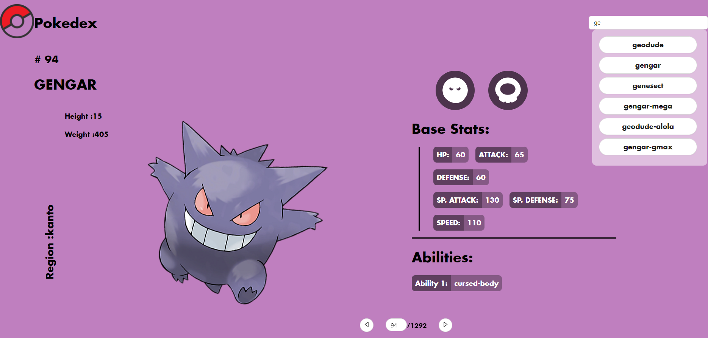

# React Pokedex




React Pokedex is a simple web application that allows you to explore and search for information about various Pokemon. It uses the Pokemon API to fetch data and display it in an organized manner.

## Table of Contents

- [Demo](#demo)
- [Features](#features)
- [Getting Started](#getting-started)
- [Usage](#usage)
- [API](#api)
- [Contributing](#contributing)

## Demo

You can see a live demo of the React Pokedex here: [Live Demo](https://react-pokedex-vite.vercel.app)

## Features

- View a list of Pokemon with their names and images.
- Search for specific Pokemon by name or ID.
- Responsive design for both desktop and mobile.

## Getting Started

These instructions will help you set up the project on your local machine.

### Prerequisites

- [Node.js](https://nodejs.org/) and [npm](https://www.npmjs.com/) installed on your system.

### Installation

1. Clone this repository to your local machine:

   ```shell
   git clone https://github.com/Ryotard/react-pokedex-vite.git

   ```

2. Navigate to the project directory:

   ```shell
   cd react-pokedex-vite

   ```

3. Install the project dependencies:

   ```shell
   npm install
   ```


## Usage

To start the development server, run:

   ```shell
    npm run dev
   ```

## API 

The React Pokedex application uses the [Pokemon API](https://pokeapi.co) to fetch Pokemon data. You can explore the API documentation to learn more about the available endpoints and data.

## Contributing
Contributions are welcome! If you'd like to contribute to this project, please follow these guidelines:

1. Fork the repository.
2. Create a new branch for your feature or bug fix.
3. Make your changes and commit them with descriptive commit messages.
4. Push your changes to your fork.
5. Create a pull request to the main branch of this repository.